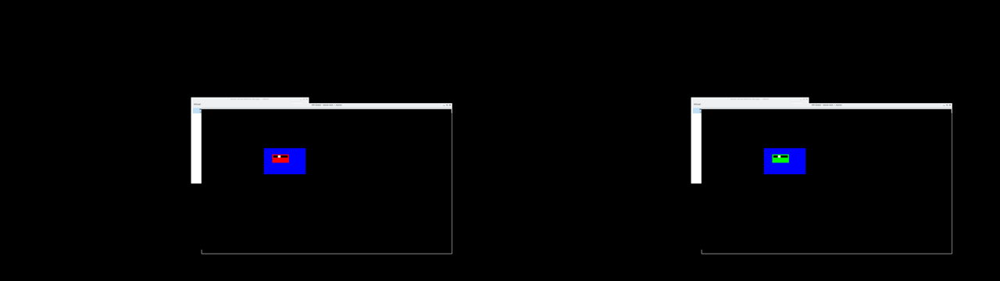

# A virtual machine with a 3D display

A guide for users and developers who want a virtual machine whose display has HDMI 3D modes, shown on the host as a stereo window.
It also covers rendering the guest on the host's strongest GPU, and passing a whole second GPU to the guest.



*A Sparky Stereo OS guest in side by side (full), shown by Karton under Stereo KWin: the host's capture holds one view per eye, the red marker in the left eye and the green one in the right, the window around it identical in both.*

**Status (2026-10-09):** the virtual machine is QEMU, and every way of watching it on the edition's desktop shows its 3D modes in stereo: QEMU's own window, virt-viewer and Karton.
- **It needs Stereo KWin on the host** (the edition's KWin): it is what shows each view to its eye on the screen you have, a 3D television, anaglyph or another stereo output. On any other desktop the window shows the left view only.
- QEMU: the edition's `qemu` package (1:11.1.2+ds-1+stereo3d2) gives the guest the 3D modes and tells the host which layout each frame uses, in its own window and to SPICE clients.
- SPICE, which carries the screen to virt-viewer, virt-manager and Karton: the edition's `spice-protocol` (0.14.5-1+stereo3d1), `spice` (0.16.0-3+stereo3d1) and `spice-gtk` (0.42-4+stereo3d1) carry the layout.
- Karton: the edition's `karton` package (0.1~prealpha+git20260905.08e13cf-1+stereo3d1), branch [`stereo3d`](https://invent.kde.org/danielcamposramos/karton/-/tree/stereo3d).
- The guest side, two patches to the Linux `virtio-gpu` driver (branch [`vm/virtio-gpu-stereo`](https://github.com/Sparky-OS/linux/tree/vm/virtio-gpu-stereo)), is not yet in the edition's kernel.

QEMU's own contribution policy (`docs/devel/code-provenance.rst`) declines code generated with AI tools, so the QEMU changes stay in Sparky Stereo OS.

## How it works

A real 3D television says in its EDID which 3D modes it accepts, and the computer tells it which one it is sending in the HDMI vendor InfoFrame.
The virtual machine does the same, in three places:

1. **The EDID.** QEMU's `virtio-gpu` device, with `stereo=on`, adds an HDMI Vendor-Specific Data Block to the EDID it gives the guest: "3D present" (the mandatory 3D formats of HDMI 1.4b for 1080p24, 720p50 and 720p60) and, for 1080p60, frame packing, side by side (full), top-and-bottom and side by side (half).
2. **The guest's driver.** The guest's `virtio-gpu` driver lists those modes when the device offers stereo (`VIRTIO_GPU_F_STEREO`), and on every mode set tells the device the layout: which 3D structure, where each eye sits in the frame, and the size of one eye. This is the InfoFrame's job on a cable.
3. **The host window.** QEMU's GTK display shows the guest at one eye's size. It draws the left eye in its window and, on a Wayland desktop with Stereo KWin, puts both eyes over it, side by side, left eye first, each at full size, and declares that once as stereo. Stereo KWin then sends it to whatever the host's screen does: a 3D television's own 3D mode, anaglyph, or the left eye on a 2D screen.

A guest compositor packs its desktop for the 3D mode it set; QEMU unpacks it again.
Frame packing and side by side (full) keep both eyes at full resolution and are copied as they are; top-and-bottom and side by side (half) carry half an eye each and are stretched back.
For a virtual machine, side by side (full) is the natural mode: it is already the host's own format.

## Run it

```sh
qemu-system-x86_64 -machine q35 -accel kvm -cpu host -m 4G \
    -device virtio-gpu-pci,stereo=on -display gtk,zoom-to-fit=off \
    ...
```

In the guest, the display settings list the 3D modes (labelled 3D-FP, 3D-SBS-full, 3D-TaB, 3D-SBS on Sparky Stereo OS); choose one.
On the host, the VM window shows the guest's desktop in stereo.
`zoom-to-fit=off` keeps the guest at one host pixel per guest pixel; with zooming, both eyes are scaled together.

Give the device more host memory than the default 256 MiB for switching between 3D modes (`max_hostmem=1G`): with the default, the last switch of a long sequence can fail and the display stops.

### In virt-viewer, virt-manager or Karton

These show the guest through SPICE: run the VM with `-device virtio-gpu-pci,stereo=on,max_hostmem=1G` and a SPICE display (with libvirt, the device line through `qemu:commandline`).
The viewer sizes its window to one view and, on Stereo KWin, shows the two views side by side on a declared surface; without Stereo KWin it shows the left view.
virt-viewer and Karton were tested; virt-manager uses the same `spice-gtk` widget as virt-viewer.

## The strongest GPU renders

A guest renders 3D through `virtio-gpu` with virgl (OpenGL) or Venus (Vulkan), on a host GPU's render node.
That GPU does not have to be the one that drives the host's screens: QEMU renders on the render node it is given, and Stereo KWin shows the window on whichever GPU drives the screen.

- **virgl (OpenGL):** `-device virtio-vga-gl` (or `virtio-gpu-gl-pci`) with a GL display, for example `-display egl-headless,rendernode=/dev/dri/renderD129` to pick the render node.
- **Venus (Vulkan):** `-device virtio-gpu-gl-pci,blob=on,hostmem=4G,venus=on`; it needs the host GPU's Vulkan driver and virglrenderer's render server (`/usr/libexec/virgl_render_server`, Debian's `virgl-server` package). In the guest, `vulkaninfo --summary` then names the host GPU, for example "Virtio-GPU Venus (NVIDIA GeForce RTX 3060)".
- **Native contexts** (the guest runs the GPU's own driver userspace) exist in virglrenderer for amdgpu, Intel i915, msm (Qualcomm), Asahi and Panfrost; not for NVIDIA.

Find which render node belongs to which GPU:

```sh
for r in /sys/class/drm/renderD*; do
    echo "$r $(basename "$(readlink -f "$r/device/driver")")"
done
```

Stereo works the same way with a GL display: with `-display gtk,gl=on`, QEMU draws the left eye in its window and puts both eyes on the declared surface over it, whether the guest renders with virgl or Venus.

## Pass a whole second GPU to the guest (VFIO)

The guest gets the whole GPU and drives its outputs itself, with its own drivers; the host keeps the GPU that drives its screens.
A 3D television on the passed GPU's HDMI port then works in the guest exactly as on a real computer.
While the guest owns it, the host cannot use that GPU or the screens connected to it.

1. **Firmware.** Enable the IOMMU (AMD: "IOMMU" or "AMD-Vi" and SVM; Intel: VT-d and VT-x) and make the GPU that should stay with the host the primary display.
2. **Kernel.** Linux uses the AMD IOMMU when the firmware enables it; for Intel, add `intel_iommu=on` if the kernel does not turn it on by default. Add `iommu=pt` to the kernel command line so host devices skip translation. Check: `dmesg | grep -iE 'AMD-Vi|DMAR'`.
3. **IOMMU groups.** A device can only be passed with everything in its group. List them:
   ```sh
   for d in /sys/kernel/iommu_groups/*/devices/*; do
       g=${d#/sys/kernel/iommu_groups/}; echo "group ${g%%/*}: $(lspci -nns "${d##*/}")"
   done
   ```
   The GPU and its HDMI audio function should be alone in their group, for example `01:00.0 [10de:2504]` and `01:00.1 [10de:228e]` for an RTX 3060.
4. **Give the GPU to vfio-pci at boot**, before its own driver takes it. In `/etc/modprobe.d/vfio.conf`:
   ```
   options vfio-pci ids=10de:2504,10de:228e
   softdep nvidia pre: vfio-pci
   softdep nouveau pre: vfio-pci
   ```
   On Debian, add `vfio`, `vfio_iommu_type1` and `vfio_pci` to `/etc/initramfs-tools/modules`, run `update-initramfs -u` and reboot. Check: `lspci -nnk -s 01:00` says `Kernel driver in use: vfio-pci`.
   To keep the GPU for the host most of the time, leave this out and let libvirt detach and reattach it when the VM starts and stops (`managed='yes'` below); nothing on the host may be using the GPU then.
5. **The VM.** Use UEFI firmware (OVMF) and q35:
   ```sh
   qemu-system-x86_64 -machine q35 -accel kvm -cpu host -m 8G \
       -drive if=pflash,format=raw,readonly=on,file=/usr/share/OVMF/OVMF_CODE_4M.fd \
       -drive if=pflash,format=raw,file=my_vars.fd \
       -device vfio-pci,host=0000:01:00.0,multifunction=on \
       -device vfio-pci,host=0000:01:00.1 \
       ...
   ```
   With libvirt (virt-manager, Karton), add the two functions as PCI host devices:
   ```xml
   <hostdev mode='subsystem' type='pci' managed='yes'>
     <source><address domain='0x0000' bus='0x01' slot='0x00' function='0x0'/></source>
   </hostdev>
   ```
   and the same for function `0x1`.
6. **In the guest**, install the GPU's driver and the stereo stack as on a real computer; the 3D television connected to that GPU shows the guest's 3D modes.

## Limits

- With `gl=on`, QEMU reads each stereo frame back from the GPU to show both eyes: one copy per frame.
- QEMU's GTK display on X11 (`GDK_BACKEND=x11`) shows the packed frame with `gl=on`; use it on Wayland.
- SPICE sends a frame in tiles, so a viewer can for a moment show the two views from different frames (seen once in six Karton runs); a frame boundary in the protocol would fix it.
- Without Stereo KWin (or another compositor that takes the declaration), the window shows the left eye.
- Interlaced 3D modes (1080i side by side half) are not listed: `virtio-gpu` does not allow interlaced modes.
